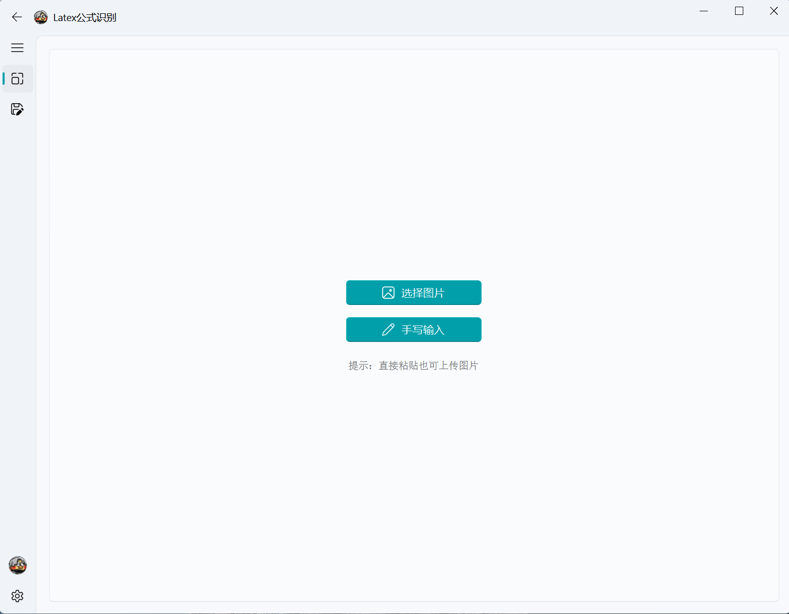
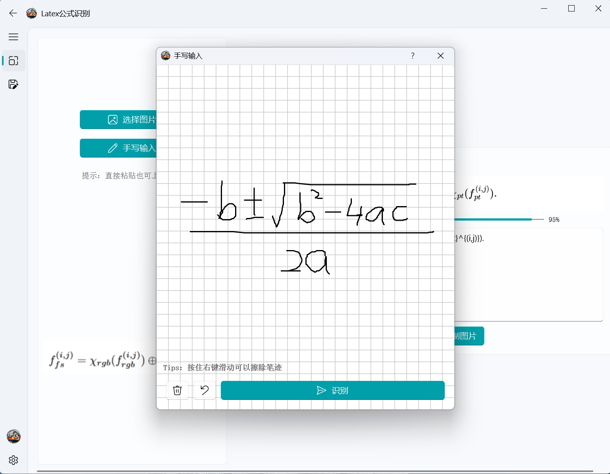
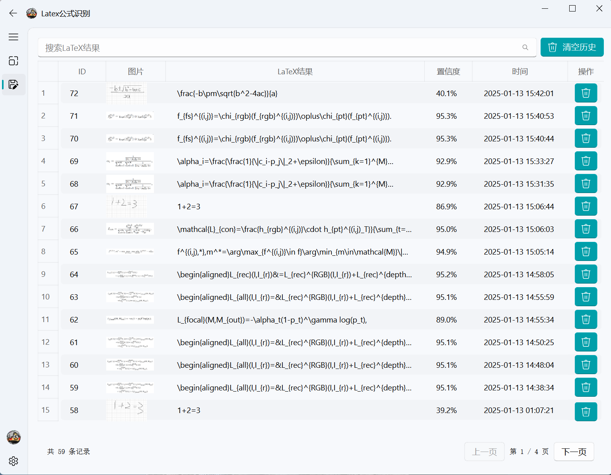
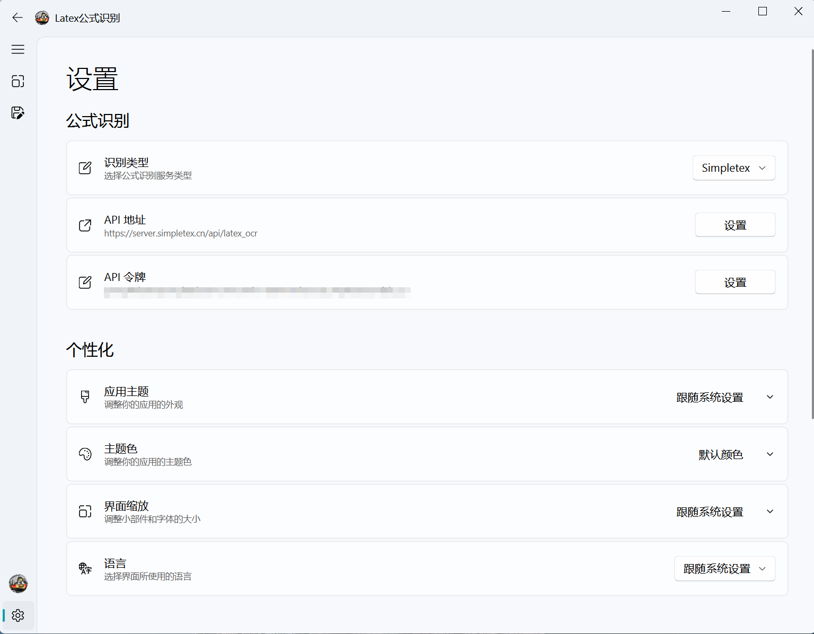
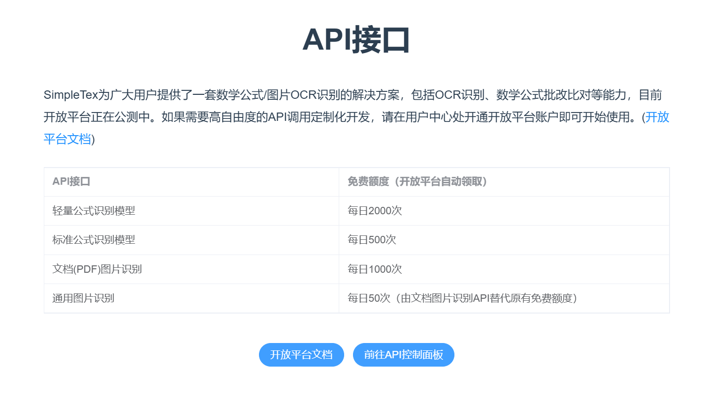

# LaTeX OCR GUI

一个基于 PyQt5 的 LaTeX 公式识别工具，支持多种输入方式，提供美观的图形界面。

## 功能特点

- 🖼️ 多种输入方式
  - 选择本地图片文件
  - 直接粘贴图片
  - 手写输入（支持撤销和擦除）
  
- 🎯 识别结果展示
  - 实时 LaTeX 公式渲染
  - 置信度显示
  - 支持编辑修改
  
- 📋 便捷的复制选项
  - 复制纯文本
  - 复制带 $$ 的 LaTeX 代码
  - 复制渲染后的公式图片
  
- 📝 历史记录管理
  - 自动保存识别记录
  - 支持搜索查找
  - 支持复制和删除
  - 分页显示

## 界面预览

### 主界面


### 手写输入


### 历史记录


### 设置界面


## 使用说明

1. 配置 API
   - 在设置页面配置 Simpletex API 地址和令牌
   - 目前仅支持 [Simpletex](https://simpletex.cn/api)，后续会扩展支持其他服务
   
   - 项目使用的是标准公式识别模型，每日免费500次

2. 识别公式
   - 选择图片：点击"选择图片"按钮上传本地图片
   - 粘贴图片：直接 Ctrl+V 粘贴剪贴板中的图片
   - 手写输入：点击"手写输入"，在画板上书写公式
     - 右键拖动可以擦除笔迹
     - 支持撤销操作

3. 处理结果
   - 查看渲染效果
   - 编辑修改 LaTeX 代码
   - 使用不同的复制选项
   - 查看历史记录

## 技术特点

- 🎨 基于 PyQt5 + qfluentwidgets 构建现代化界面
- 🔌 抽象的 OCR 服务接口，方便扩展其他服务商
- 💾 使用 SQLite 管理本地历史记录
- ✨ 实时渲染 LaTeX 公式
- 📱 支持高分辨率显示

## 开发计划

- [ ] 支持更多公式识别服务商
- [ ] 添加批量识别功能
- [ ] 支持导出历史记录
- [ ] 优化手写识别体验
- [ ] 添加快捷键支持

## 依赖项

- Python 3.8+
- PyQt5
- qfluentwidgets
- PyQtWebEngine
- OpenCV
- NumPy
- Requests

## 安装说明

1. 克隆仓库
```
git clone https://github.com/zhiqing0205/LatexOCR-GUI.git
```

2. 安装依赖
```
pip install -r requirements.txt
```

3. 运行程序
```
python main.py
```

4. 配置 API
   - 在设置页面配置 Simpletex API 地址和令牌
   - 目前仅支持 Simpletex，后续会扩展支持其他服务

5. 打包
```
pyinstaller --onefile --windowed -i images/ikun.ico -n LatexOCR-GUI main.py
```

## 许可证

[MIT License](LICENSE)